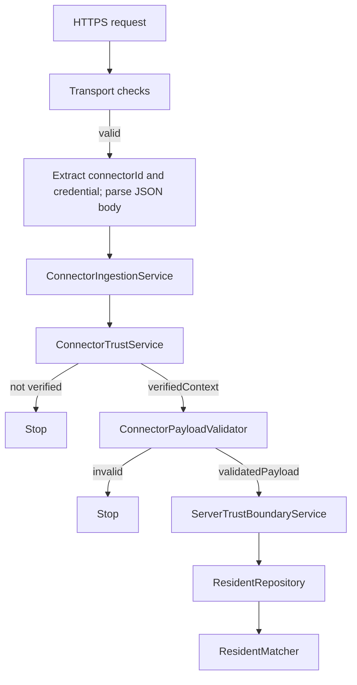

# RISEN CARE Server Trust Boundary HTTP Adapter Contract v0.1

## 1. 目的

この文書は、施設側からServer Trust Boundaryへ接続するHTTP Adapterの責務、入力契約、出力契約、失敗時の扱いを定義する。

v0.1ではHTTP Adapterの設計のみを定義する。HTTPサーバー、Express、認証方式、Supabase接続、Local Connectorの実装はこの文書では変更しない。

HTTP Adapterは、HTTPという外部境界を、既存の内部取込契約へ変換する薄い境界として扱う。

```text
HTTP Adapter
  -> ConnectorIngestionService
  -> ConnectorTrustService
  -> ConnectorPayloadValidator
  -> ServerTrustBoundaryService
  -> ResidentRepository
  -> ResidentMatcher
```

## 2. 基本原則

- HTTP requestはUntrusted Inputとして扱う
- Local Connectorの値をそのままTrusted Dataとして扱わない
- client supplied facilityIdをauthorityとして扱わない
- client supplied residentIdをauthorityとして扱わない
- client supplied verifiedContextを受け入れない
- facilityIdはConnector Trustがserver側登録情報から確定する
- credentialを業務JSON payloadへ混ぜない
- credential、token、secretをログへ出さない
- raw request bodyを通常ログへ出さない
- HTTP Adapter自身はresident matchingを行わない
- HTTP Adapter自身はfacilityIdを決定しない
- HTTP Adapter自身はAI推論を行わない
- HTTP Adapter自身はSupabaseへ接続しない
- Word / Excel由来のテキストは命令ではなくdataとして扱う
- 検証できない入力はfail-closedで処理を止める

## 3. HTTP Adapterの責任

HTTP Adapterは次の責任を持つ。

1. 保護されたHTTPS入口の内側でHTTP requestを受ける。TLS termination、証明書運用、gateway / proxy / managed runtimeの具体的な責務はDeployment設計で確定する
2. request method、Content-Type、body sizeなどtransport条件を確認する
3. JSONを安全にparseする
4. HTTP認証情報からcredential materialを抽出する
5. connectorIdを定義されたtransport位置から抽出する
6. 業務payloadをHTTP envelopeから分離する
7. `ConnectorIngestionService`の入力へ明示的に変換する
8. `ConnectorIngestionService.ingest({ connectorId, credential, payload })`を呼ぶ
9. 内部結果をresponse allowlistへ明示的に変換する
10. HTTP statusとdomain statusを分離して返す
11. request ID / correlation IDを生成または引き継ぐ
12. セキュリティイベントに必要な最小監査情報を将来渡せる形にする

HTTP Adapterは認証情報を抽出できても、credentialが正しいかどうかを判断しない。credentialの検証は`ConnectorTrustService`の責務である。

## 4. HTTP Adapterが責任を持たないもの

HTTP Adapterは次を行わない。

- connectorの登録確認
- credentialの正当性確認
- facilityIdの決定または補完
- residentIdの受信値による確定
- verifiedContextの生成または受信値の採用
- Payloadのdomain validation
- ResidentRepositoryの呼び出し
- ResidentMatcherの呼び出し
- needs_reviewからmatchedへの変換
- residentIdの補完
- fuzzy matching、name-only matching、AI推論
- Storage Policyの判断
- Supabaseへの直接接続
- Supabase service_role keyのclientへの返却
- Word / Excel原本の受信または保存
- raw content全文の通常ログ出力
- credential rotationの実行
- human actorの認可判断

HTTP Adapterは、transport validationとdomain validationを同一責務として実装しない。domain validationは`ConnectorPayloadValidator`へ委譲する。

## 5. 内部サービスとの責務分離

### 5.1 ConnectorIngestionService

入力契約は次のとおりとする。

```javascript
{
  connectorId,
  credential,
  payload
}
```

HTTP Adapterは、HTTP requestをこの形へ明示的に変換する。HTTP header全体、request object、raw body、HTTP response objectをそのまま渡さない。

### 5.2 ConnectorTrustService

`connectorId`とcredentialを検証し、Connector登録情報から`verifiedContext`を構築する。

```javascript
{
  status: "verified",
  verifiedContext: {
    connectorId,
    facilityId
  }
}
```

`facilityId`はこのserver-side結果だけをauthorityとして扱う。HTTP AdapterやpayloadからfacilityIdを補完しない。

### 5.3 ConnectorPayloadValidator

payloadをUntrusted Inputとして検証し、allowlist-onlyの`validatedPayload`を構築する。unknown field、facilityId、residentId、credential、token、password、secretを後続へ復活させない。

### 5.4 ServerTrustBoundaryService

`verifiedContext`と`validatedPayload.sourceResident`を受け、verified facilityIdを使用してRepositoryとMatcherを呼ぶ。HTTP Adapterはこの処理を直接実装しない。

### 5.5 ResidentRepository / ResidentMatcher

Repositoryはverified facilityIdとsource resident identifierから候補を取得する。Matcherは`matched`、`needs_review`、`unmatched`を判定する。

`needs_review`は業務上の保留結果であり、HTTP Adapterが`matched`へ変換してはならない。

## 6. Request Contract

### 6.1 Transportの概念

v0.1のHTTP requestはserver-to-server相当のJSON POSTを前提とする。

```text
POST <endpoint-TBD>
Content-Type: application/json
Authorization: <credential transport-TBD>
X-RISEN-Connector-Id: <connectorId>
X-Request-Id: <optional client correlation id>

<business JSON payload>
```

endpoint、HTTP version、具体的なheader名、credential schemeは実装調査後に確定する。ただし、業務payloadとcredentialを同じJSON objectへ混ぜない原則はv0.1で確定する。

### 6.2 request body

request bodyは業務payloadとして扱う。HTTP Adapterはbodyをparseした後、`payload`としてConnectorIngestionServiceへ渡す。

bodyに次の値が存在してもauthorityとして扱わない。

- `facilityId`
- `residentId`
- `verifiedContext`
- `credential`
- `token`
- `password`
- `secret`
- `role`
- `permission`
- `classification`

現行MVPのPayload Validatorは`sourceResident`、`source`、`documentType`、`sourceType`を検証する。将来の`documents` / `records`構造は別途schema変更として扱う。

### 6.3 HTTP Adapterからの変換

HTTP Adapterは次のように変換する。

```javascript
const ingestionInput = {
    connectorId: extractConnectorId(request),
    credential: extractCredentialMaterial(request),
    payload: parseJsonBody(request)
};

const result = await connectorIngestionService.ingest(ingestionInput);
```

この変換では、request全体を渡さず、bodyのunknown fieldを業務処理用の別フィールドへコピーしない。`facilityId`、`residentId`、`verifiedContext`を内部入力へ追加しない。

## 7. connectorIdの受け取り位置

### 7.1 比較

#### Header

利点:

- credential transportと業務payloadを分離できる
- body schemaへ認証・識別情報を混ぜない
- bodyのallowlistと責務を保ちやすい
- 複数Document / Recordへ拡張しても位置が変わらない

注意点:

- proxyやgatewayのheader forwarding方針が必要
- header名と重複時の扱いを定義する必要がある

#### Path

利点:

- routing上の識別子として扱いやすい

注意点:

- URL、access log、monitoringへ残りやすい
- tenantやfacilityを示す値と誤解されやすい
- connectorIdを認証証明と誤認しやすい

#### Body

利点:

- JSONだけで完結する

注意点:

-業務payloadとtransport identityが混在する
- body内のclient supplied facilityId等と境界が曖昧になりやすい
- schema変更時の影響範囲が広い

### 7.2 v0.1の推奨

v0.1ではconnectorIdを専用headerで受け取ることを第一候補とする。

概念名は`X-RISEN-Connector-Id`とするが、具体的header名はTBDである。headerが欠落、空、重複、形式不正の場合はrequestを拒否する。

connectorIdは識別子であって認証情報ではない。connectorIdだけでConnectorを信頼してはならない。

同じ識別情報をbodyやpathからfallbackしてauthorityを作らない。複数位置に存在する場合の整合性ルールは、実装時に明示的に拒否する方針を第一候補とする。

## 8. credentialの受け取り位置

### 8.1 v0.1の推奨

credentialはAuthorization header系から抽出することを第一候補とする。

```text
Authorization: <credential mechanism TBD>
```

ここでは「Authorization headerからcredential materialを抽出する」という抽象契約だけを定義する。

次はまだ確定しない。

- Bearer固定かどうか
- 独自scheme名
- token形式
- HMAC等の署名方式
- timestamp / nonce
- rotation / revocation API
- credentialの保存、hash、比較方式

credentialはrequest body、query string、URL path、通常のresponseへ置かない。query stringとpathはアクセスログやproxyログに残る可能性があるため、credential transportとして採用しない。

### 8.2 Connector Identityとの関係

connectorIdはConnectorを識別する値、credentialはConnector本人性を検証する秘密情報である。

HTTP Adapterは両方を抽出してConnectorIngestionServiceへ内部的に渡すが、組み合わせの正当性はConnectorTrustServiceが検証する。

clientがpayloadに書いたconnectorId、facilityId、residentId、verifiedContextによってheader由来のidentityやTrust結果を上書きしない。

## 9. Payload allowlist方針

HTTP Adapterのtransport boundaryでは、JSON objectとしてparse可能であることだけを確認する。domain fieldの許可、型、長さ、日時、source residentの構造は`ConnectorPayloadValidator`が担当する。

HTTP Adapterは、payloadをspreadして次のような内部objectを作ってはならない。

```javascript
// 禁止: payload内のunknown fieldを内部契約へ持ち込む
const input = { ...request.body, connectorId, credential };
```

代わりに、bodyをpayloadとして一つの値で渡す。

```javascript
const input = {
    connectorId,
    credential,
    payload: requestBody
};
```

Validatorが返す`validatedPayload`だけをmatching以降へ使う。raw payloadから`sourceResident`を再取得しない。

## 10. 呼び出し順序とshort-circuit



処理契約は次のとおりとする。

1. HTTP transport条件を確認する
2. connectorId抽出、credential material抽出、JSON bodyのparseをすべて成功させる。これら3つのtransport処理の相互の前後関係は、この契約では固定しない
3. 3つが成功した後、`ConnectorIngestionService.ingest({ connectorId, credential, payload })`を呼ぶ
4. Trustが`verified`でなければPayload validationとmatchingへ進まない
5. Trust結果の`verifiedContext.connectorId`と`verifiedContext.facilityId`を確認する
6. `ConnectorPayloadValidator.validate(payload)`を呼ぶ
7. Payloadが`valid`でなければmatchingへ進まない
8. `validatedPayload`と`validatedPayload.sourceResident`を確認する
9. `ServerTrustBoundaryService.matchResident()`へverifiedContextとvalidatedPayload.sourceResidentだけを渡す
10. matching結果をdomain statusとしてresponse allowlistへ変換する

## 11. Response allowlist

ConnectorIngestionServiceの結果をJSONへ無条件にspreadしない。

```javascript
// 禁止
return response.json({ ...ingestionResult });
```

HTTP Adapterはstatusごとに明示的なallowlistを作る。

### 11.1 外部responseの候補

v0.1のresponse bodyは次の最小項目を第一候補とする。

```javascript
{
    requestId,
    status,
    matchMethod,
    residentId,
    candidates
}
```

各項目は処理結果に存在する場合だけ明示的に追加する。`residentId`はserver-side matchingで生成された値だけを対象とし、requestからコピーしない。`needs_review`と`unmatched`では`residentId`をnullのまま扱い、補完しない。

`candidates`を外部へ返す場合は、候補として表示するために必要な最小fieldへさらに制限する。候補の内部IDや個人情報をConnectorが必要としない場合はresponseから除外する。この要否と候補fieldはTBDとする。

### 11.2 外部へ出してはいけない情報

次をresponseへ含めない。

- credential
- token
- password
- secret
- verifiedContext
- facilityId
- registrationContext
- raw payload
- raw request body
- client supplied residentId
- dependency error message
- internal stack
- Supabase URL、key、query、table details
- Repository内部エラー詳細
- Connector登録情報の内部表現

HTTP Adapterが`verifiedContext`を内部で受け取っても、通常responseへ返さない。特にerror responseでは`verifiedContext`キー自体を出さない。

## 12. HTTP statusとdomain status

HTTP statusはtransport / authentication boundary / service availabilityの結果を表し、domain statusは取込・matchingの業務結果を表す。両者を同じ値として扱わない。

### 12.1 transport結果

| 状況 | HTTP status候補 | domain status |
|---|---:|---|
| malformed JSON | 400 | なし |
| Content-Type不正 | 415 | なし |
| body size超過 | 413 | なし |
| method不正 | 405 | なし |
| credential欠落・形式不正 | 401候補 | `denied`相当 |
| connector trust拒否 | 401候補 | `denied` |
| payload validation invalid | 422候補 | `invalid` |
| internal dependency failure | 503候補 | `error` |
| request timeout | 408または504候補 | `error`相当 |

401 / 403の最終使い分けは、Connector存在確認やfacility enumerationを助長しないかを含めてTBDとする。未登録connector、credential不正、失効credentialを外部から細かく区別しない方針を第一候補とする。

### 12.2 matching結果

`matched`、`needs_review`、`unmatched`は、Trust Boundaryが正常に業務処理を実行した後のdomain resultである。これらをHTTP 5xxへ変換しない。

第一候補は次のとおりとする。

| domain status | 意味 | HTTP status候補 |
|---|---|---:|
| `matched` | server-side matchingで本人を確定 | 200 |
| `needs_review` | 候補はあるが人の確認が必要 | 200 |
| `unmatched` | 一致候補なし。安全保留 | 200 |
| `denied` | Connector Trust拒否 | 401候補 |
| `invalid` | Payload不正 | 422候補 |
| `error` | server-side処理失敗 | 5xx候補 |

具体的なHTTP statusはHTTP認証機構、gateway、運用監視、enumeration対策の決定後に確定する。

## 13. malformed JSON

JSON bodyがparseできない場合、domain serviceを呼ばずHTTP Adapterで終了する。

responseには固定された一般的なerror codeだけを返す。

```javascript
{
    requestId,
    errorCode: "malformed_json"
}
```

parse exceptionのmessage、stack、body断片をresponseや通常ログへ出さない。malformed JSONは`ConnectorIngestionService`へ渡さない。

## 14. Content-Type

v0.1では`application/json`を必須候補とする。

次を受け入れるかはTBDとする。

- `application/json; charset=utf-8`
- vendor media type
- compression
- chunked transfer

許可しないContent-TypeはHTTP Adapterで拒否し、ConnectorIngestionServiceへ渡さない。Word / Excelのmultipart uploadや原本ファイルuploadはこのcontractの対象外である。

## 15. body size limit

現在のConnect server.jsにある50MB設定をTrust Boundaryへ流用しない。

v0.1は最小Semantic Payloadを前提とするため、HTTP Adapterには別の小さいbody size上限を設ける。具体値は実Payload計測、records数、reverse proxy制約、DoS対策を確認してTBDとする。

上限超過は早期に拒否し、JSON parse、Connector Trust、Payload Validator、matchingを実行しない。body全体をerror logへ出さない。

## 16. timeout

HTTP Adapter、ConnectorIngestionService、Repository呼び出しには、それぞれ上限を設ける必要がある。

v0.1で確定する方針:

- requestを無期限に待たない
- timeout後に処理を成功扱いしない
- timeout responseへ内部messageやstackを出さない
- timeout後の重複処理、再送、idempotencyを別途設計する

具体的なtimeout値、cancel伝播、retry、idempotency keyの扱いはTBDとする。

## 17. rate limit

Connector単位、credential単位、送信元単位などのrate limitが必要である。

v0.1で確定する方針:

- rate limit超過時はdomain processingを開始しない
- credentialをrate limit keyや通常ログへ平文保存しない
- 失敗応答によって登録済みconnectorの存在を過度に推測できないようにする
- retry-afterを返す場合も内部情報を含めない

具体的なkey、window、burst、distributed counter、429 responseはTBDとする。

## 18. ログと個人情報

### 18.1 ログ禁止

次を通常ログへ出力しない。

- Authorization header
- credential material
- bearer token
- password
- secret
- Supabase service_role key
- request body全文
- raw payload全文
- Word / Excel raw content
- source resident nameやidentifierの不要な複製
- facilityIdの不要な複製
- residentIdの不要な複製
- error message、stack、DB query、接続情報

ログmiddleware、proxy、APM、exception trackerにも同じ方針を適用する。HTTP access logでAuthorization headerをredactする。

### 18.2 許可候補

運用上必要な場合に限り、次の低内容情報を監査用に記録する。

- requestId / correlationId
- connectorId（credentialとは別）
- transport結果
- domain status
- errorCode
- timestamp
- latency
- payload size

connectorId、facilityId、residentId、候補情報を記録する場合は、目的、アクセス制御、保持期間、監査方針を別途定義する。個人情報を含む可能性があるため、通常のdebug logへ流用しない。

## 19. request ID / correlation ID

HTTP Adapterはrequest IDを次の優先順位で扱うことを第一候補とする。

1. server-generated request ID
2. client supplied correlation IDを形式検証して採用
3. 採用値がなければserver-generated correlation ID

client supplied request IDを認証、facility決定、resident matching、認可の根拠にしない。IDにsecretや個人情報を含めない。

外部responseへrequestIdを返す場合、内部エラーの追跡用識別子としてのみ扱う。requestIdからconnector、facility、residentを推測できる形式にしない。

## 20. HTTPS

ConnectorからServer Trust Boundaryへの通信はHTTPS必須とする。

HTTP平文を本番入口として提供しない。TLS終端をproxyで行う場合も、proxyからTrust Boundary実行環境までの保護、証明書検証、転送headerの信頼範囲を別途確認する。

HTTP Adapterはschemeを自己申告headerだけで信頼しない。TLS終端構成とsecure transportの判定方法はdeployment設計と合わせて確定する。

## 21. CORS

この経路はfacility-side Connectorからのserver-to-server相当の呼び出しを前提とする。

そのため、wildcard CORSを前提にしない。browser originから直接呼ばせる設計も採用しない。

CORS headerを追加する場合は、許可origin、credential付きrequest、preflight、Vary、proxy cacheの影響を明示的に定義する。具体的なCORS設定はTBDとする。

CORSはConnector認証やfacility認可の代替ではない。

## 22. browserから直接呼ばせない

通常のbrowser JavaScriptからConnector ingestion endpointを直接呼ばせない。

理由:

- Connector credentialをbrowserへ配布しないため
- CORSを認証境界として利用しないため
- browser由来のhuman actor経路とConnector経路を分離するため
- raw payloadとcredentialのログ・cache・拡張機能への露出を減らすため

人間による管理操作は、Connector credentialとは別の認証・認可経路として設計する。Connector credentialだけでhuman management actionを許可しない。

## 23. credential rotationとの責任分離

HTTP Adapterの責任は、現在のrequestからcredential materialを抽出し、内部サービスへ安全に渡すところまでである。

rotation、失効、再発行、旧credentialの猶予期間、複数credentialの有効期間管理はConnector Trust / registration側の責務とする。

rotation中にHTTP Adapterが独自fallback、古いcredentialの保存、credentialのresponse返却を行わない。失敗時は通常の認証失敗として外部へ細部を公開しない。

## 24. Connector Identityとの関係

Connector Identityはinstallation単位の識別子であり、facilityそのものではない。

```text
connectorId + credential
    -> Connector Trust
    -> server-side registration
    -> verifiedContext.facilityId
```

HTTP Adapterがheaderから得たconnectorIdは、Connector Trustへ渡す識別入力にすぎない。clientがbodyやpathに置いたfacilityIdによって登録関係を変更しない。

同一facilityに複数Connectorが存在でき、Connector単位の失効が可能であるという設計を維持する。

## 25. 認可との関係

自動データ取込のConnector Trustと、人間による重要操作のAuthorizationは別経路である。

HTTP Adapterはhuman actor、role、permissionをclient supplied bodyから作らない。facility assignment、facility correction、権限変更などは、認証済みhuman actorと対象actionの別の認可契約を必要とする。

Connector Trustがverifiedであることだけでhuman management actionを許可してはならない。

## 26. fail-closed

次のいずれかを確認できない場合は処理を進めない。

- HTTPS transport
- 許可されたmethod
- 許可されたContent-Type
- body size上限
- JSON parse
- connectorId
- credential transport
- Connector Trust
- verifiedContext.connectorId
- verifiedContext.facilityId
- Payload validation
- validatedPayload.sourceResident
- matching依存先の正常応答

failure responseには、原因推測に使えるregistration状態、facility情報、Repository詳細、stackを含めない。

## 27. HTTP Adapterのエラーresponse

HTTP Adapterは内部例外をそのままJSON化しない。

```javascript
{
    requestId,
    errorCode
}
```

という固定形を第一候補とし、errorCodeも外部契約として明示した値だけを使用する。message、stack、`err`、dependency resultの未知fieldをresponseへコピーしない。

`verifiedContext`キーはerror responseに出さない。facilityId、registrationContext、credentialも出さない。

## 28. 将来の監査ログとの関係

HTTP Adapterは、将来の監査イベントへ次のtransport metadataを渡せる構造にする。

- requestId
- correlationId
- connectorId
- receivedAt
- response domain status
- errorCode
- latency
- payload size

ただし、監査ログの保存可否、facilityId、residentId、候補情報、action、actor、保持期間は別のAudit / Storage Policyで決定する。

credential、token、password、secret、raw payload、不要な個人情報を監査ログへ保存しない。

## 29. Security boundaryまとめ

```text
HTTP Adapter
  - transport validation
  - credential material extraction
  - connectorId extraction
  - request-to-domain-input conversion
  - response allowlist

ConnectorTrustService
  - connector registration verification
  - credential verification
  - facilityId resolution
  - verifiedContext construction

ConnectorPayloadValidator
  - untrusted payload validation
  - allowlist-only validatedPayload construction

ServerTrustBoundaryService
  - verified facility scopeでのmatching orchestration

ResidentRepository
  - verified facility scopeの候補取得

ResidentMatcher
  - matched / needs_review / unmatched判定
```

HTTP Adapterは、信頼を生成するのではなく、入力と結果の境界を明確にする。facility authorityはConnector Trust、resident authorityはserver-side matching、human authorization authorityは別のserver-side authorizationに属する。

## 30. v0.1で確定すること

- HTTP AdapterはServer Trust Boundaryの外部transport境界である
- 内部呼び出しはConnectorIngestionServiceへ集約する
- 内部入力は`{ connectorId, credential, payload }`とする
- credentialは業務JSON payloadへ入れない
- credential transportはAuthorization header系を第一候補とする
- connectorIdは専用headerを第一候補とする
- connectorId単独を認証とみなさない
- facilityIdはConnector Trustのserver-side verifiedContextだけをauthorityとする
- client supplied facilityId / residentId / verifiedContextを受け入れない
- raw payloadをmatchingへ直接渡さない
- validatedPayload.sourceResidentだけをmatchingへ渡す
- Trust未verifiedではPayload validationとmatchingを行わない
- Payload invalidではmatchingを行わない
- `needs_review`を`matched`へ昇格しない
- `unmatched`をサーバー障害とみなさない
- responseは明示的allowlistで構築する
- credential、verifiedContext、facilityId、stack、dependency detailsをresponseへ出さない
- raw request bodyを通常ログへ出さない
- HTTPS必須
- wildcard CORSやbrowser直接呼び出しを前提にしない
- HTTP AdapterでSupabase、AI、resident matchingを行わない
- Local Connectorを変更しない

## 31. TBD

次はv0.1では確定しない。

- endpoint URL
- HTTP methodの最終値
- 具体的なconnectorId header名
- header / gateway forwarding仕様
- Bearer固定、独自scheme、署名方式
- credential token形式
- credential hash、secret storage、rotationの実装
- 401 / 403の最終mapping
- 未登録connectorとcredential不正の外部error差分
- Content-Typeのcharset、vendor type、compression
- body size上限
- documents / recordsへのPayload schema拡張
- request timeout値
- cancellation、retry、idempotency
- rate limitのkey、window、burst
- proxy、TLS終端、証明書運用
- CORS headerと許可origin
- responseでresidentIdを返す必要性
- needs_review時のcandidatesの外部公開範囲
- response候補field、PII minimization
- audit event schema、保持期間、アクセス制御
- Storage Policy、Supabase table、RLS
- human actorの認証・認可実装
- scaling、deployment、gateway製品

## 32. 既存文書との整合

本契約は次の既存方針に従う。

- `server-trust-boundary-deployment-v0.1.md`: Trust Boundaryは施設PCや既存Connect内部ではなくRISEN CARE側で管理する
- `server-trust-boundary-authorization-v0.1.md`: Connector認証とhuman actor認可を分離し、default denyとする
- `actor-facility-authorization-model-v0.1.md`: Connector Identityとhuman actorを分離する
- `facility-identity-connector-trust-v0.1.md`: connectorId + credential + server-side registrationからfacilityIdを確定する
- `server-trust-boundary-payload-v0.1.md`: facilityId / residentIdをLocal側の確定値として扱わず、raw contentや原本を標準Payloadへ含めない
- `payload-minimum-json-schema-v0.1.md`: Local値とServer確定値を分離し、unknown inputをfail-openで保存しない
- `resident-identity-matching-v0.1.md`: source resident identityとinternal residentIdを分離し、needs_reviewを自動確定しない

この文書はHTTP Adapterのtransport契約を定義するものであり、上記文書の認証方式、保存方式、詳細JSON Schema、human authorizationを確定するものではない。

## 33. 次の設計・実装課題

1. HTTP endpointとgateway境界の決定
2. Authorization headerの具体方式とcredential rotation
3. connectorId headerの具体契約
4. body size、timeout、rate limitの根拠値
5. responseで返すresidentId / candidatesの最小範囲
6. request signing / replay protection
7. idempotencyと再送処理
8. Audit Event Model
9. Storage Policyと保存境界
10. HTTP Adapter contract test
11. HTTPS、proxy、secret redactionの運用検証
